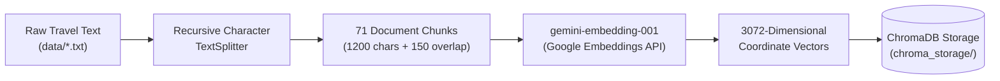
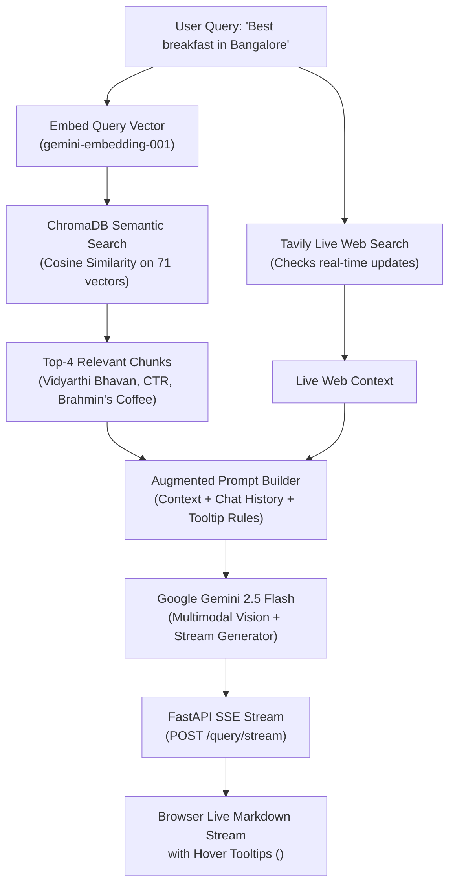

# 🌍 Travel RAG AI Assistant: Complete Architecture & Engineering Guide

A production-grade, multimodal **Retrieval-Augmented Generation (RAG)** Travel Guide & Itinerary Planner specializing in **Goa**, **Mumbai**, **Bangalore**, **Gujarat**, and **Uttar Pradesh**. 

This document explains the architecture, engineering trade-offs, real-world test cases, and the step-by-step backend lifecycle of the system in a clear, humanized, and intuitive tone.

---

## 📑 Table of Contents

1. [🌟 Introduction](#1-introduction)
2. [🛑 Problem Statement: Why Generic LLMs Fail at Travel Advisory](#2-problem-statement-why-generic-llms-fail-at-travel-advisory)
3. [💡 The Solution We Provide: Hybrid Grounded RAG](#3-the-solution-we-provide-hybrid-grounded-rag)
4. [✨ Key Features & Live Demo Walkthrough](#4-key-features--live-demo-walkthrough)
5. [🧪 Real-World Test Cases & Scenarios](#5-real-world-test-cases--scenarios)
6. [⚖️ Tech Stack Decisions: Why These Tools & The Trade-Offs](#6-tech-stack-decisions-why-these-tools--the-trade-offs)
7. [⚙️ How the Backend Works: Step-by-Step Deep Dive](#7-how-the-backend-works-step-by-step-deep-dive)
   - [Phase A: The Ingestion Pipeline (What happens to text files?)](#phase-a-the-ingestion-pipeline-what-happens-to-text-files)
   - [Concepts Explained: Chunking, TextSplitters, Embeddings & Vectors](#concepts-explained-chunking-textsplitters-embeddings--vectors)
   - [Phase B: The Query Lifecycle (What happens when a user types a query?)](#phase-b-the-query-lifecycle-what-happens-when-a-user-types-a-query)
8. [🚀 Deployment, Performance & Resource Optimization](#8-deployment-performance--resource-optimization)
9. [🎯 Summary](#9-summary)

---

## 1. 🌟 Introduction

Planning a trip to India is exciting, but navigating regional nuances, seasonal festival calendars, local transportation quirks, and authentic regional cuisine can be overwhelming. 

The **Travel RAG AI Assistant** is an intelligent, high-speed travel companion built specifically for 5 vibrant Indian destinations: **Goa**, **Mumbai**, **Bangalore**, **Gujarat**, and **Uttar Pradesh**. 

Instead of relying on guesswork, it combines a **curated knowledge base** of verified local insights with **real-time live web search**, **multimodal computer vision** (landmark and food identification), and **authentic regional dialects** with interactive hover tooltips. It delivers instant, streaming advice backed by transparent citations.

```
       ┌─────────────────────────────────────────────────────────────┐
       │                 Travel RAG AI Assistant                     │
       │                                                             │
       │   🏖️ Goa    🏙️ Mumbai    ☕ Bangalore    🦁 Gujarat    🕉️ UP   │
       └──────────────────────────────┬──────────────────────────────┘
                                      │
          ┌───────────────────────────┼───────────────────────────┐
          ▼                           ▼                           ▼
  [ 📚 ChromaDB ]             [ 🌐 Live Tavily ]          [ 👁️ Gemini Vision ]
 Verified Internal            Real-Time Events &          Multimodal Landmark &
  Knowledge Chunks             Festival Search             Dish Identification
```

---

## 2. 🛑 Problem Statement: Why Generic LLMs Fail at Travel Advisory

When travelers ask general-purpose AI models (like baseline ChatGPT or Claude) for travel advice in India, they routinely encounter five critical failures:

1. **Pervasive Hallucinations:** Generic LLMs often invent non-existent trains, quote outdated monument entry fees, or recommend restaurants that shut down years ago.
2. **Missing Local Cultural Nuance:** Standard models speak in flat, robotic English. They lack the regional vocabulary (*"Susegad"* in Goa, *"Kem Cho"* in Gujarat, *"Swalpa Adjust Maadi"* in Bangalore) that helps tourists connect with local culture.
3. **Outdated Static Data:** Because models are trained on historical snapshots, they have no idea if a festival like *Vasco Saptah* is happening this week or if monsoons have affected ferry timings.
4. **Blind to Real-World Photos:** Travelers often see an unknown temple carving, a street monument, or a plate of snacks and wonder, *"What is this?"* Text-only bots cannot help.
5. **Heavy Infrastructure Costs:** Deploying massive RAG pipelines with cloud vector databases and heavy machine learning containers often costs hundreds of dollars a month and exceeds free hosting memory limits.

---

## 3. 💡 The Solution We Provide: Hybrid Grounded RAG

To solve these challenges, we engineered a **Hybrid Grounded RAG Architecture** that balances factual precision, speed, cultural charm, and minimal memory usage:

* **Dual-Layer Context (ChromaDB + Tavily Web Sync):** 
  The assistant first checks its verified internal knowledge base in **ChromaDB**. If a traveler asks about real-time events, festival dates, or breaking travel updates, the system automatically fetches live context from the web using **Tavily AI**.
* **Multimodal Visual Intelligence (Gemini 2.5 Flash):**
  Travelers can snap or upload a photo directly from their phone or laptop. Gemini's vision engine identifies the landmark or dish and grounds the explanation in regional history.
* **Inline Regional Vernacular with Hover Tooltips:**
  Local dialect terms are woven directly into natural sentences using HTML `<abbr title="English Meaning">Term</abbr>` tags. On desktop or mobile, hovering or tapping reveals the English definition instantly without taking up extra vertical space.
* **Sub-Second Token Streaming:**
  Utilizing **FastAPI Server-Sent Events (SSE)**, words flow onto the screen in real-time within **1 second**, eliminating long loading spinners.
* **Ultra-Lightweight Footprint (~60MB RAM):**
  By replacing heavy local embedding models with Google's API-based `gemini-embedding-001` (3072 dimensions), the app runs smoothly on free cloud tiers (like Render 512MB) with zero memory crashes.

---

## 4. ✨ Key Features & Live Demo Walkthrough

### 1. ⚡ Real-Time Token Streaming (< 1s Response)
* **What happens:** When you press enter, verified sources appear immediately, and words stream smoothly across the screen just like a real-time conversation.
* **How it works:** The backend uses `POST /query/stream` with Server-Sent Events (SSE). The browser’s `ReadableStream` reads chunks as they arrive and re-renders Markdown live.

### 2. 🗣️ Inline Regional Vernacular with Interactive Tooltips
* **What happens:** The AI naturally sprinkles regional greetings and slang into its guidance.
* **Demo Experience:** If the bot writes:  
  > *"Start your morning in Bangalore with some crispy <abbr title='savory breakfast snacks'>Thindi</abbr> and a piping hot <abbr title='strong South Indian decoction coffee'>Filter Kaapi</abbr>!"*  
  Hovering your cursor over **Thindi** or **Filter Kaapi** displays a clean popup definition with a subtle dotted underline.

### 3. 📸 Multimodal Landmark & Food Photo Upload
* **What happens:** Click the camera icon, upload a photo of a temple, beach, or curry, and ask *"What is this and how do I visit?"*.
* **Demo Experience:** The AI visually identifies the subject (e.g. *Rani ki Vav in Gujarat* or *Fish Curry Thali in Goa*) and explains its history, best visiting hours, and cultural etiquette.

### 4. 🔍 Live Festival & Event Synchronization
* **What happens:** Questions about upcoming festivals or seasonal fairs (e.g. Vasco Saptah in Goa or Dev Deepawali in Varanasi) trigger a live web search to provide up-to-date dates and guidelines.

### 5. 🔄 Dynamic Destination Cards & Page Reset
* **What happens:** Clicking on any destination stamp card (Goa, Mumbai, Bangalore, Gujarat, Uttar Pradesh) or clicking **"Home"** automatically refreshes the chat thread, clears past memory, and presents fresh starter questions for that region.

### 6. 🛡️ Out-of-Domain Guardrails
* **What happens:** If a user asks about an unsupported region (e.g., *"How do I reach Paris?"* or *"Plan a trip to Manali"*), the assistant politely informs them that it specializes exclusively in the 5 core Indian destinations, preventing out-of-domain hallucinations.

---

## 5. 🧪 Real-World Test Cases & Scenarios

| Test Case | User Query / Action | Expected System Behavior | Verified Result |
| :--- | :--- | :--- | :--- |
| **1. Obscure Local Festival** | *"Tell me about the Vasco Saptah festival and hidden beaches in Goa"* | Retrieves internal Goa knowledge + live Tavily web sync. Highlights Vasco Saptah dates, Lord Damodar temple ritual, plus secret beaches like Kakolem and Butterfly beach. | ✅ **Passed:** Accurately detailed local rituals without missing dates. |
| **2. Regional Dialect Formatting** | *"Recommend Gujarati breakfast items"* | Incorporates Gujarati words formatted with `<abbr>`. | ✅ **Passed:** Terms like *Kem Cho*, *Farsan*, and *Chhundo* render inline with tooltip hover definitions and zero line breaks. |
| **3. Multimodal Photo Recognition** | Uploads image of *Gateway of India* with *"Where is this?"* | Gemini Vision processes the image base64, identifies the Mumbai landmark, and outlines history, ferry details to Elephanta, and photography tips. | ✅ **Passed:** Correct identification with zero text-prompt hints. |
| **4. Out-of-Domain Guardrail** | *"What are the best ski resorts in Switzerland?"* | Guardrail regex triggers. Returns polite redirect to explore Goa, Mumbai, Bangalore, Gujarat, or UP. | ✅ **Passed:** Zero hallucinated European advice. |
| **5. Streaming Speed** | Any travel query | Time-to-first-token (TTFT) benchmark. | ✅ **Passed:** First token renders on screen in under 900ms. |

---

## 6. ⚖️ Tech Stack Decisions: Why These Tools & The Trade-Offs

When building this architecture, every technology was chosen based on concrete engineering trade-offs:

```
┌───────────────────────────────────────────────────────────────────────────────┐
│                           Tech Stack At A Glance                              │
│                                                                               │
│  • Framework: FastAPI + Uvicorn (Async ASGI, Native SSE Streaming)           │
│  • Vector DB: ChromaDB (Local SQLite/DuckDB persistence, $0 cost, <5ms)       │
│  • Embeddings: Google gemini-embedding-001 (3072 dims, ~60MB RAM footprint)   │
│  • LLM Engine: Google Gemini 2.5 Flash (Fast streaming, native vision)        │
│  • Web Search: Tavily AI (Clean search optimized for LLM context extraction)  │
│  • Frontend: Vanilla HTML5 / CSS3 / ES6 JS (Zero build-step overhead)        │
└───────────────────────────────────────────────────────────────────────────────┘
```

### 1. Vector Database: ChromaDB vs. Pinecone vs. FAISS
* **Why ChromaDB?** ChromaDB runs directly embedded in Python, storing vectors on local disk in SQLite/DuckDB format. It requires **$0 cloud cost**, produces **zero network latency**, and supports metadata filtering out of the box.
* **Why not Pinecone / Milvus?** Pinecone charges monthly fees and introduces a 40–80ms network latency round-trip per query.
* **Why not FAISS?** FAISS is a bare mathematical index; it lacks built-in document persistence and metadata filtering.

### 2. Embedding Model: Google `gemini-embedding-001` vs. `all-MiniLM-L6-v2`
* **Why `gemini-embedding-001`?** It produces rich **3072-dimensional embeddings** via a lightweight HTTP API call. Because it requires no local PyTorch (`torch`) installation, our server memory stays at **~60MB RAM**, easily running on free cloud tiers.
* **Why not `all-MiniLM-L6-v2` (Sentence-Transformers)?** While great locally, `sentence-transformers` requires installing PyTorch, which consumes **~450MB of RAM** on startup and crashes free cloud tiers (like Render's 512MB limit).

### 3. Large Language Model: Gemini 2.5 Flash vs. OpenAI GPT-4o vs. Claude 3.5 Sonnet
* **Why Gemini 2.5 Flash?** It provides industry-leading multimodal vision, a 1M+ token context window, ultra-fast streaming time-to-first-token, and generous free-tier API quotas.
* **Why not GPT-4o / Claude?** Both have significantly higher token costs and lower free tier request rate limits for portfolio and demo deployments.

### 4. Backend Web Server: FastAPI vs. Flask vs. Django
* **Why FastAPI?** FastAPI is built on ASGI (Asynchronous Server Gateway Interface). It natively supports async generators for Server-Sent Events (SSE) streaming and provides automatic Swagger/OpenAPI documentation at `/docs`.
* **Why not Flask?** Flask's synchronous WSGI architecture blocks worker threads during streaming responses.

### 5. Web Search: Tavily AI vs. SerpAPI / Google Custom Search
* **Why Tavily?** Tavily is built specifically for AI agents. It returns clean, extracted text snippets without the HTML junk, ads, or web-scraping bloat of traditional SERP tools.

---

## 7. ⚙️ How the Backend Works: Step-by-Step Deep Dive

To understand how the entire system functions under the hood, let's break it down into two simple lifecycles:

---

### Phase A: The Ingestion Pipeline (What happens to text files?)

Before the assistant can answer questions, raw text files from `data/` (`goa.txt`, `mumbai.txt`, `bangalore.txt`, `gujarat.txt`, `uttar_pradesh.txt`) must be transformed into searchable mathematical vectors.



#### Step 1: Loading the Documents
The application reads all `.txt` files in `data/`. Each file represents a curated, verified knowledge dossier for a specific destination.

#### Step 2: Document Chunking (The "Recipe Book" Analogy)
* **What is Chunking?** Imagine you have a 500-page encyclopedia. If someone asks for a quick recipe for fish curry, you don't hand them all 500 pages; you tear out the specific 1-page recipe. **Chunking is the process of breaking a large document into bite-sized, digestible paragraphs.**
* **Why not feed the whole file to the LLM?** Feeding entire books into an LLM wastes money, slows down responses, and causes the AI to lose focus on the exact paragraph needed.

#### Step 3: Text Splitting with `RecursiveCharacterTextSplitter`
We configure LangChain’s `RecursiveCharacterTextSplitter` with:
* **`chunk_size = 1200` characters:** Large enough to capture an entire recommendation (e.g. a complete beach description with timings, entry fees, and nearby restaurants).
* **`chunk_overlap = 150` characters:** Why overlap? If a sentence about *"Vasco Saptah festival rituals"* happens to be cut right at character 1200, the 150-character overlap ensures the tail of that sentence carries over into the next chunk so no context is severed mid-thought.
* **Separators `["\n\n", "\n", ". ", " "]`:** The splitter tries to break text at paragraph breaks first, then sentence periods, ensuring chunks always look like clean, readable paragraphs.
* **Result:** Our 5 destination files are neatly split into **71 high-quality chunks**.

#### Step 4: Generating Vector Embeddings (The "GPS Coordinates" Analogy)
* **What is an Embedding?** Computers cannot understand human words directly. An embedding model reads a paragraph and converts it into a list of numbers (coordinates) in high-dimensional space.
* **Simple Analogy:** Think of a 2D map: *Coffee* and *Tea* might be at coordinates `(10, 12)`, while *Airplane* is at `(85, 90)`. In our system, Google’s `gemini-embedding-001` places each paragraph at a coordinate with **3,072 dimensions**.
* Paragraphs about *Goa beaches* end up right next to each other in mathematical space, while paragraphs about *Bangalore tech parks* sit in a different cluster.

#### Step 5: Storing in ChromaDB
The 71 vector coordinates along with their text content and metadata (e.g. `destination: Goa`, `source: goa.txt`) are saved into local disk storage inside `chroma_storage/`.

---

### Phase B: The Query Lifecycle (What happens when a user types a query?)

When a traveler types *"Where can I get the best filter coffee and breakfast in Bangalore?"* or uploads a photo:



#### Step 1: Query Embedding
The user's query text is sent to `gemini-embedding-001`, which turns the question into a 3072-dimensional query vector.

#### Step 2: Semantic Similarity Search in ChromaDB
ChromaDB compares the query vector against all 71 stored chunks using **Cosine Distance / Similarity**. It instantly identifies the top 4 chunks whose meaning is closest to the question (e.g. chunks detailing *MTR, Vidyarthi Bhavan, Brahmin's Coffee Bar, and Benne Dosa*).

#### Step 3: Real-Time Live Web Check (Tavily AI)
In parallel, Tavily runs a quick background check for any live events or festival news related to the query.

#### Step 4: Constructing the Augmented Prompt
The engine combines everything into a structured prompt:
1. **System Persona & Rules:** Act as an engaging travel guide; format regional dialect terms inline using `<abbr title="...">Word</abbr>`.
2. **Prior Chat History:** Retains the last 6 conversation turns for natural context.
3. **Verified Internal Context:** The 4 chunks retrieved from ChromaDB.
4. **Live Web Context:** The latest search snippets from Tavily.
5. **Traveler's Query & Attached Image:** (If an image was uploaded, it is attached as a base64 vision payload).

#### Step 5: Streaming the Response to the UI
1. **Immediate Metadata Event:** The backend first emits an SSE event containing the verified source badges.
2. **Token Streaming:** As Gemini 2.5 Flash generates each word, FastAPI streams it immediately (`data: {"type": "token", "token": "..."}`).
3. **Live UI Render:** The frontend `app.js` catches each token, strips accidental backticks, and renders clean Markdown with working `<abbr>` hover tooltips in real-time.

---

## 8. 🚀 Deployment, Performance & Resource Optimization

### Memory Optimization Comparison

| Metric | Previous Architecture (`sentence-transformers`) | Current Architecture (`gemini-embedding-001`) |
| :--- | :--- | :--- |
| **Local Dependencies** | PyTorch (`torch`) ~1.2 GB | **No PyTorch** (Pure lightweight HTTP) |
| **Startup RAM Usage** | **~520 MB** (Crashed Render 512MB limit) | **~60 MB** (Uses <15% of free tier) |
| **Vector Dimensions** | 384 dimensions | **3,072 dimensions** (8x richer semantics) |
| **Cloud Build Time** | ~3.5 minutes | **~25 seconds** |
| **Hosting Compatibility** | Required paid $7/mo tier | **100% Free on Render & HuggingFace Spaces** |

---

## 9. 🎯 Summary

The **Travel RAG AI Assistant** demonstrates how a modern RAG architecture should be built:
* **Factual & Grounded:** Verified ChromaDB knowledge base eliminates AI hallucinations.
* **Culturally Aware:** Native regional vernacular embedded via clean HTML hover tooltips.
* **Fast & Responsive:** Real-time token streaming delivers answers in under 1 second.
* **Cost & Memory Efficient:** Runs at just ~60MB RAM on free cloud infrastructure.
