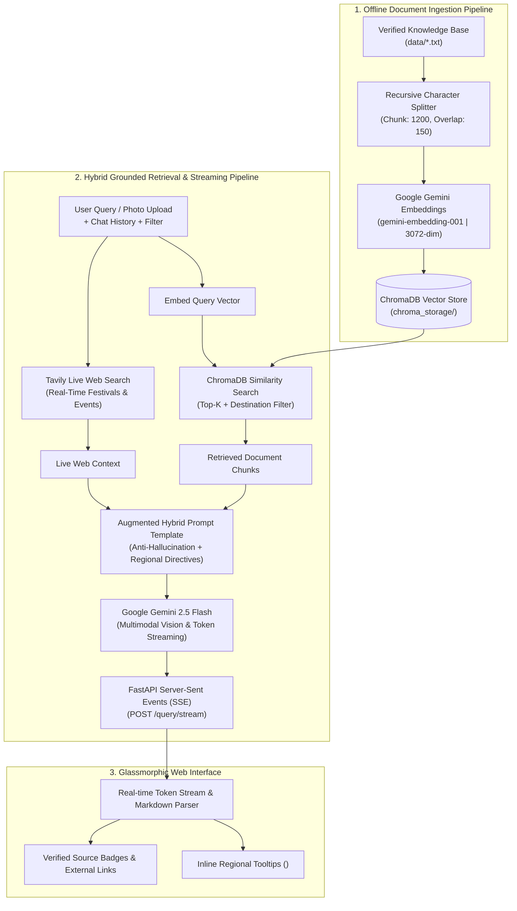

# 🌍 Travel RAG AI Assistant

[](https://www.python.org/)
[](https://fastapi.tiangolo.com/)
[](https://www.langchain.com/)
[](https://www.trychroma.com/)
[](https://ai.google.dev/)
[](https://tavily.com/)
[](https://render.com/)

A production-grade **Retrieval-Augmented Generation (RAG)** Travel Guide & Itinerary Planner built with **FastAPI**, **LangChain**, **ChromaDB**, **Google Gemini 2.5 Flash**, **Google `gemini-embedding-001`**, and **Tavily Live Web Search**.

The system specializes in **5 core Indian destinations** (**Goa**, **Mumbai**, **Bangalore**, **Gujarat**, and **Uttar Pradesh**), delivering real-time streaming tokens, verified source badges, multimodal image recognition for monuments/dishes, authentic regional language with hover tooltips, and live web-grounded travel advice.

---

## 🏗️ Architecture & Data Flow



---

## ✨ Key Features

1. **⚡ Real-Time Token Streaming (<1s Latency):**
   - Emits verified source citations immediately and streams response tokens chunk-by-chunk using Server-Sent Events (`POST /query/stream`), eliminating perceived wait times.

2. **🔍 Hybrid Grounded Knowledge (ChromaDB + Tavily Live Search):**
   - Combines 71 deeply verified internal knowledge chunks with real-time live web search fallback for up-to-date festival schedules (e.g. Vasco Saptah in Goa, Dev Deepawali in Varanasi).

3. **🗣️ Inline Regional Vernacular with Hover Tooltips:**
   - Seamlessly integrates regional vocabulary directly into sentences using HTML `<abbr title="English Meaning">RegionalTerm</abbr>` with custom CSS tooltips (e.g., *Susegad*, *Kem Cho? Majama!*, *Filter Kaapi*, *Aamchi Mumbai*, *Radhe Radhe!*).

4. **📸 Multimodal Image Recognition (Gemini Vision):**
   - Travelers can upload or snap a photo of an unknown temple, historical monument, or local street food dish and receive culturally grounded analysis.

5. **🧠 Conversational Memory & Fresh Page Switching:**
   - Retains multi-turn context within a conversation and automatically resets memory when navigating to a new destination card or clicking "Home".

6. **☁️ Ultra-Lightweight & Cloud Optimized (~60MB RAM):**
   - Uses API-based `gemini-embedding-001` (3072 dimensions) with zero local PyTorch overhead, running seamlessly on free cloud containers (Render 512MB limit).

---

## 🛠️ Tech Stack

### **Backend & AI Pipeline**
- **Python 3.10+**
- **FastAPI & Uvicorn:** Async REST API and Server-Sent Events (SSE) streaming engine.
- **LangChain & LCEL:** Prompt templating, memory chaining, and document splitting.
- **ChromaDB:** High-performance local vector database with metadata filtering.
- **Google `gemini-embedding-001`:** High-dimensional (3072-dim) dense embeddings via API.
- **Google Gemini 2.5 Flash:** Ultra-fast multimodal reasoning and generative streaming.
- **Tavily AI:** Real-time search API for travel verification and live events.

### **Frontend & Visuals**
- **HTML5 & Vanilla CSS3:** Custom dark-themed glassmorphism, responsive grid layout, and pulse animations.
- **JavaScript (ES6+):** `ReadableStream` SSE parser, Lucide icon hydration, and marked.js markdown rendering.
- **Lucide Icons:** Clean vector SVG icons for UI controls and modals.

---

## 📂 Project Structure

```text
travel-rag-core/
├── data/                       # Verified travel knowledge base files
│   ├── bangalore.txt           # Bangalore tech parks, darshinis, breweries, heritage
│   ├── goa.txt                 # Goa beaches, churches, food, festivals (Vasco Saptah)
│   ├── gujarat.txt             # Rann of Kutch, Statue of Unity, temples, snacks
│   ├── mumbai.txt              # Marine Drive, street food, heritage, Bollywood
│   └── uttar_pradesh.txt       # Varanasi ghats, Ayodhya, Lucknow cuisine, Agra
├── static/                     # Frontend web application assets
│   ├── images/                 # Destination stamp images & backgrounds
│   │   ├── bangalore.jpeg
│   │   ├── bkgrnd.jpeg
│   │   ├── goa.jpeg
│   │   ├── gujarat.jpeg
│   │   ├── mumbai.jpeg
│   │   └── uttar_pradesh.jpeg
│   ├── index.html              # Main web UI & About App modal
│   ├── style.css               # Design system, tooltips, glassmorphism, pulse
│   └── app.js                  # SSE streaming, image preview, destination switching
├── chroma_storage/             # Pre-indexed ChromaDB vector database (71 vectors)
├── main.py                     # FastAPI application, REST endpoints, and static mounts
├── rag_engine.py               # Core RAG engine, Gemini streaming, Tavily sync
├── requirements.txt            # Lightweight production dependencies
├── .env.example                # Example environment variables
├── .gitignore                  # Git ignore rules
└── README.md                   # Project documentation
```

---

## 🚀 Quickstart Guide (Local Setup)

### **1. Clone the Repository**
```bash
git clone https://github.com/your-username/travel-rag-core.git
cd travel-rag-core
```

### **2. Create & Activate Virtual Environment**
```bash
# Windows
python -m venv .venv
.venv\Scripts\activate

# macOS / Linux
python3 -m venv .venv
source .venv/bin/activate
```

### **3. Install Dependencies**
```bash
pip install -r requirements.txt
```

### **4. Configure Environment Variables**
Create a `.env` file in the root directory:
```env
GOOGLE_API_KEY=your_google_gemini_api_key_here
TAVILY_API_KEY=your_tavily_api_key_here
```

### **5. Run the Application**
```bash
uvicorn main:app --reload --port 8000
```
Open your browser and navigate to: **`http://localhost:8000`**

---

## ☁️ Deployment on Render (Free Tier)

This repository is pre-configured for **1-click deployment on Render**:

1. Create a **New Web Service** on [Render](https://dashboard.render.com/) and connect this GitHub repo.
2. Set configuration:
   - **Runtime**: `Python 3`
   - **Build Command**: `pip install -r requirements.txt`
   - **Start Command**: `uvicorn main:app --host 0.0.0.0 --port $PORT`
   - **Instance Type**: `Free` (512MB RAM)
3. Add Environment Variables:
   - `GOOGLE_API_KEY` = `your-api-key`
   - `TAVILY_API_KEY` = `your-api-key`
4. Click **Deploy Web Service**!

---

## 📡 REST API Reference

### **1. Stream Travel Query (SSE)**
`POST /query/stream`

Streams response tokens in real-time.

**Request Body:**
```json
{
  "query": "What are the best street food spots and iconic cafes in Bangalore?",
  "destination": "Bangalore",
  "top_k": 4,
  "chat_history": []
}
```

---

### **2. Synchronous Query**
`POST /query`

Returns complete JSON response with answer, sources, and images.

---

### **3. Generate Structured Itinerary**
`POST /itinerary`

**Request Body:**
```json
{
  "destination": "Goa",
  "days": 3,
  "budget": "Mid-Range"
}
```

---

### **4. System Health Check**
`GET /health`

**Response:**
```json
{
  "status": "healthy",
  "total_vectors_in_db": 71,
  "embedding_model": "google/gemini-embedding-001"
}
```

---

## 🛡️ Anti-Hallucination & Domain Integrity

1. **Grounded Internal Knowledge:** Every response synthesizes facts from verified `.txt` knowledge chunks stored in ChromaDB.
2. **Out-of-Domain Guard:** Queries regarding unsupported states or international regions are politely redirected to explore the 5 supported destinations.
3. **Transparent Citations:** Verified source badges with destination origin and live web links are emitted alongside every generation.

---

## 📄 License
This project is open source and available under the [MIT License](LICENSE).
