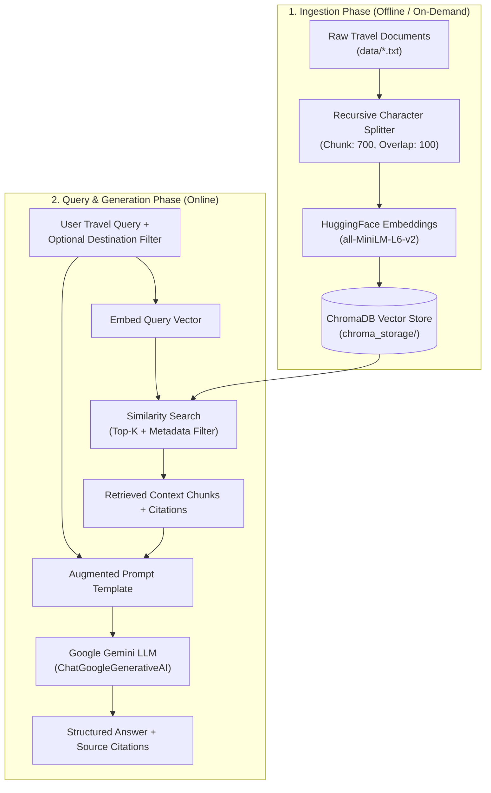

# 🌍 AI Travel Assistant: Production-Grade RAG System

A comprehensive, end-to-end **Retrieval-Augmented Generation (RAG)** Travel Guide assistant built from scratch using **LangChain**, **ChromaDB**, **Sentence Transformers (HuggingFace)**, and **Google Gemini LLM**.

> **💡 Note on Voice-Over Callouts:** Every section below contains an integrated **`🎙️ Voice-Over / Spoken Explanation`** block. You can read these directly when presenting, demoing in a meeting, recording a video walkthrough, or explaining the concepts in an interview.

---

## 📌 Table of Contents
1. [Problem Statement & Motivation](#-problem-statement--motivation)
2. [Why RAG? (Core Concepts & Visual Architecture)](#-why-rag-core-concepts--visual-architecture)
3. [Deep-Dive into RAG Building Blocks](#-deep-dive-into-rag-building-blocks)
   - [1. Data Curation & Knowledge Base](#1-data-curation--knowledge-base)
   - [2. Document Chunking Strategy](#2-document-chunking-strategy)
   - [3. Vector Embeddings](#3-vector-embeddings)
   - [4. Vector Database & Storage (ChromaDB)](#4-vector-database--storage-chromadb)
   - [5. Hybrid Semantic Retrieval & Metadata Filtering](#5-hybrid-semantic-retrieval--metadata-filtering)
   - [6. Grounded Prompt Engineering & LCEL Generation](#6-grounded-prompt-engineering--lcel-generation)
4. [Step-by-Step Implementation from Scratch](#-step-by-step-implementation-from-scratch)
5. [Complete Source Code Walkthrough](#-complete-source-code-walkthrough)
6. [How to Run and Test](#-how-to-run-and-test)
7. [Engineering Challenges & Key Learnings](#-engineering-challenges--key-learnings)

---

## 🎯 Problem Statement & Motivation

### The Problem with Pure LLMs
Standard Large Language Models (LLMs) like GPT-4 or Gemini are trained on vast amounts of public web data, but suffer from critical flaws when acting as specialized travel guides:
1. **Hallucinations**: When asked about niche local attractions, specific seasonal timings, or lesser-known markets, LLMs frequently fabricate convincing but non-existent recommendations.
2. **Lack of Private / Verified Local Knowledge**: Generic models don't possess curated, verified, and localized travel facts (e.g., specific river ferry routes, high-tide warnings, local market days).
3. **No Source Attribution**: Standard model outputs cannot prove *where* their advice came from or verify its truth.

### The Solution: Retrieval-Augmented Generation (RAG)
Instead of relying solely on the LLM's static memory, RAG connects the LLM to a **private, verified Knowledge Base**. Before answering:
1. The system **retrieves** relevant facts from our curated travel documents based on semantic similarity.
2. It **augments** the LLM prompt with those exact facts.
3. The LLM **generates** an answer strictly grounded in that verified context.

> 🎙️ **Voice-Over / How to Explain:**
> *"Imagine asking an AI for the best beach shacks or monsoon safety guidelines in Goa, and getting a totally hallucinated restaurant or outdated advice. Standard LLMs are great at conversational fluency, but they make things up and can't prove their sources. In this project, we solve this by building a production-grade Retrieval-Augmented Generation system. Think of standard AI like taking a closed-book exam relying only on memory; RAG turns it into an open-book exam where the AI looks up verified local notes before writing its answer."*

---

## 🏗 Why RAG? (Core Concepts & Visual Architecture)



> 🎙️ **Voice-Over / How to Explain:**
> *"Our architecture splits cleanly into two phases: First is the Offline Ingestion pipeline, where raw travel guides are chopped into semantic chunks, vectorized with a local embedding model, and indexed into ChromaDB. Second is the Online Query pipeline, where a user asks a question, ChromaDB retrieves the most semantically relevant chunks, and feeds them into Google Gemini to produce a grounded response with source citations."*

---

## 🧠 Deep-Dive into RAG Building Blocks

### 1. Data Curation & Knowledge Base
* **Why did we start by creating text files in `data/`?**
  A RAG system is only as good as the ground-truth data it references. We curated structured, factual travel guides for **Goa, Mumbai, Bangalore, Gujarat, and Uttar Pradesh** covering attractions, spiritual sites, markets, local cuisine, safety notes, and seasonal weather.
* **Metadata Tagging**: Each document is automatically tagged with its source file and destination name so the retrieval engine can filter by city or cite sources accurately.

> 🎙️ **Voice-Over / How to Explain:**
> *"We started by creating granular, structured text files under `data/` for five key travel regions. Every file contains verified facts on food, local transport, culture, and monsoon seasons. We tag each chunk with metadata like destination and filename so our engine can cite its sources."*

---

### 2. Document Chunking Strategy
* **Why Chunk?** Raw text documents cannot be dumped into an LLM all at once due to context window limits, token costs, and attention dilution. Breaking documents into bite-sized passages ensures that the similarity search finds the exact paragraphs answering a user's question.
* **Chunk Size (`700` characters)**: Large enough to keep an entire attraction description, seasonal guide, or food list coherent without fragmenting the meaning.
* **Chunk Overlap (`100` characters)**: Ensures sentences that span across chunk boundaries are not cut in half, maintaining semantic continuity.
* **Hierarchical Separators**: `["\n\n", "\n", ". ", " ", ""]` splits first by paragraphs, then lines, then complete sentences, avoiding mid-sentence cuts.

```python
splitter = RecursiveCharacterTextSplitter(
    chunk_size=700,
    chunk_overlap=100,
    separators=["\n\n", "\n", ". ", " ", ""]
)
```

> 🎙️ **Voice-Over / How to Explain:**
> *"You can't feed an entire 10,000-word file at once—it's expensive and dilutes the AI's focus. So we use Recursive Character Chunking with a chunk size of 700 and overlap of 100. The overlap ensures that crucial sentences spanning chunk boundaries aren't broken in half, preserving complete context."*

---

### 3. Vector Embeddings
* **What is an Embedding?** An embedding model converts textual sentences into high-dimensional numerical vectors (384 floating-point numbers). 
* **Semantic Similarity**: Sentences with similar meanings (e.g., *"monsoon rains in Goa"* and *"wet season coastal travel"*) land close together in vector space, even with zero shared keywords.
* **Why `sentence-transformers/all-MiniLM-L6-v2`?**
  - Runs **100% locally** on CPU with zero external API costs.
  - Ultra-fast latency and minimal memory footprint.
  - Yields high semantic precision for retrieval tasks.

> 🎙️ **Voice-Over / How to Explain:**
> *"Computers don't understand words; they understand geometry. We use a local embedding model, `all-MiniLM-L6-v2` from Sentence-Transformers. It converts text chunks into 384-dimensional vectors. Running locally gives us zero API costs and instant vectorization."*

---

### 4. Vector Database & Storage (ChromaDB)
* **What does ChromaDB do?** ChromaDB indexes the dense vectors using Approximate Nearest Neighbor (ANN) search, allowing sub-millisecond retrieval across thousands of chunks.
* **Disk Persistence**: Persisted locally in [`chroma_storage/`](file:///c:/Users/shrij/Desktop/travel-rag-core/chroma_storage) so embeddings are computed once and re-used on startup.
* **Clean Re-indexing**: Prevents duplicate vector bloat on reload by clearing obsolete collections before re-indexing.

```python
self.vector_store = Chroma.from_documents(
    documents=chunks,
    embedding=self.embeddings,
    collection_name="travel_knowledge",
    persist_directory=self.persist_directory
)
```

> 🎙️ **Voice-Over / How to Explain:**
> *"We store these vectors in ChromaDB, an open-source vector database that persists to disk. This means our embeddings are loaded instantly whenever the server starts up without needing to re-embed files every time."*

---

### 5. Hybrid Semantic Retrieval & Metadata Filtering
When a user asks a question:
1. The question is converted into a 384-dimensional vector using the same embedding model.
2. ChromaDB runs a **Cosine Similarity Search** to find the closest matching vectors.
3. **Adaptive Depth & Filtering**:
   - **Filtered Search (`k=4`)**: If the user asks specifically about Goa, metadata filtering limits results to `destination == "Goa"`.
   - **Broad Cross-Destination Search (`k=6`)**: If the user asks a general question (e.g., *"Best place to visit in monsoon?"*), retrieval depth automatically expands to `k=6` to pull relevant facts from multiple cities simultaneously.

```python
def retrieve(self, query: str, destination_filter: Optional[str] = None, k: Optional[int] = None):
    search_filter = None
    if destination_filter and destination_filter.lower() not in ["all", "none", ""]:
        search_filter = {"destination": destination_filter.title()}
        actual_k = k or 4
    else:
        actual_k = k or 6  # Broader search for multi-city queries

    return self.vector_store.similarity_search(query=query, k=actual_k, filter=search_filter)
```

> 🎙️ **Voice-Over / How to Explain:**
> *"When a user asks a question, our engine performs a Cosine Similarity Search. We engineered adaptive retrieval: if you filter for 'Goa', it pulls top-4 focused chunks for Goa. If you ask a broad question like 'Best place to visit in monsoon', it dynamically pulls top-6 chunks across all cities so the AI can compare destinations."*

---

### 6. Grounded Prompt Engineering & LCEL Generation
* **Strict Guardrails**: The prompt instructs Google Gemini to answer strictly using the provided context, preventing hallucinations.
* **LangChain Expression Language (LCEL)**: Piped cleanly as `prompt | llm | StrOutputParser()`.

```python
prompt_template = PromptTemplate.from_template(
    """You are an expert AI Travel Guide assistant. Answer the traveler's question accurately and comprehensively using ONLY the provided verified context.

Guidelines:
1. Ground your response strictly in the provided context across all relevant destinations.
2. If the user asks a general question, provide recommendations for EACH destination found in the context.
3. Structure your response with clear bold headings, bullet points, and practical travel/safety advice.
4. Do not make up places outside the context.

--- CONTEXT ---
{context}

--- TRAVELER QUESTION ---
{question}

--- DETAILED TRAVEL ADVICE ---"""
)
```

> 🎙️ **Voice-Over / How to Explain:**
> *"Finally, we assemble the LangChain LCEL pipeline: prompt pipes into Gemini, which pipes into a string parser. We enforce strict guardrails: Gemini is ordered to use ONLY verified context, format with bold headings and safety tips, and provide source citations."*

---

## 🛠 Step-by-Step Implementation from Scratch

```text
travel-rag-core/
├── data/                 # Curated destination text files (.txt)
├── chroma_storage/       # Persisted ChromaDB vectors on disk
├── rag_engine.py         # Complete RAG Pipeline class
├── main.py               # Interactive CLI / Terminal interface
├── test_rag.py           # Automated test suite
├── requirements.txt      # Dependencies
└── .env                  # API keys (GOOGLE_API_KEY)
```

1. **Step 1: Setup Environment** -> Install `langchain`, `langchain-chroma`, `sentence-transformers`, `google-generativeai`. Set `GOOGLE_API_KEY` in `.env`.
2. **Step 2: Add Knowledge** -> Place text files (`goa.txt`, `mumbai.txt`, `bangalore.txt`, etc.) in `data/`.
3. **Step 3: Chunk Documents** -> Use `RecursiveCharacterTextSplitter(chunk_size=700, chunk_overlap=100)`.
4. **Step 4: Vectorize & Store** -> Initialize `HuggingFaceEmbeddings` and persist chunks to `ChromaDB`.
5. **Step 5: Query & Augment** -> Build `similarity_search` with metadata filtering and inject context into the prompt.
6. **Step 6: Generate** -> Invoke Google Gemini through LCEL chain and return answer + sources.

---

## 💻 Complete Source Code Walkthrough

### 1. `rag_engine.py` (Core Engine)
The central orchestrator [`TravelRAGEngine`](file:///c:/Users/shrij/Desktop/travel-rag-core/rag_engine.py#L18) providing:
- `load_and_chunk_documents()`: Ingests `data/*.txt` and assigns metadata.
- `build_vector_store(force_reload)`: Manages ChromaDB indexing with deduplication.
- `retrieve(query, destination_filter, k)`: Performs semantic search with metadata filters.
- `generate_answer(query, destination_filter)`: Runs end-to-end RAG pipeline with source citations.

### 2. `main.py` (Interactive Terminal Assistant)
Provides an interactive loop where users can:
- Ask natural language questions.
- Apply destination filters or press Enter to search all destinations.
- Type `reindex` to reload newly added documents in `data/`.
- Type `exit` to quit.

---

## 🚀 How to Run and Test

### 1. Run Interactive CLI
```powershell
python main.py
```

**Example Interaction:**
```text
👉 Enter your travel question: Best place to visit in monsoon?
📍 Destination filter (e.g., Goa, Mumbai, Bangalore or press Enter for All): [Press Enter]

⏳ Thinking and retrieving verified context...
--------------------------------------------------
💡 AI TRAVEL ADVICE:
--------------------------------------------------
**Goa**
- Monsoon Months: June to October ("The Green Season")
- Ideal for trekking to Dudhsagar Falls, spice plantations, and the Sao Joao festival.

**Gujarat**
- Monsoon Months: July to September
- Monsoon rains turn Gir forest, Polo Forest, and Saputara into lush green paradises.

**Mumbai**
- Romantic coastal breezes and crashing waves at Marine Drive, misty greenery at Sanjay Gandhi National Park.

📚 SOURCES REFERENCED:
  • Goa (goa.txt)
  • Gujarat (gujarat.txt)
  • Mumbai (mumbai.txt)
```

### 2. Run Automated Test Suite
```powershell
python test_rag.py
```

> 🎙️ **Voice-Over / How to Explain:**
> *"Running the interactive CLI in `main.py`, you can type any query. Leaving the filter blank searches across all five regions in seconds. You get clean, bulleted travel advice backed by exact file references."*

---

## 💡 Engineering Challenges & Key Learnings

| Challenge | Root Cause | Solution |
| :--- | :--- | :--- |
| **Duplicate Vector Bloat** | Re-indexing ChromaDB was appending new embeddings to the collection rather than replacing them, multiplying vector counts (138 → 276 → 414). | Added `delete_collection()` on `force_reload=True` to wipe obsolete vectors before re-indexing. |
| **Narrow General Query Answers** | Hardcoded `k=3` caused general queries like *"Best place to visit in monsoon"* to be dominated by chunks from a single city. | Implemented dynamic retrieval: `k=4` for single-destination filters, and `k=6` for multi-destination cross-city queries. |
| **Fragmented Context** | 500-character chunks were cutting off festival descriptions and seasonal tips mid-sentence. | Increased chunk size to `700` chars with `100` overlap and sentence boundary delimiters (`. `). |
| **Windows UTF-8 Encoding** | Default Windows command prompt threw encoding errors on special characters and emojis. | Configured `sys.stdout.reconfigure(encoding="utf-8")` across entry points. |

> 🎙️ **Voice-Over / How to Explain (Conclusion):**
> *"Along the way, we solved key production challenges: preventing duplicate vector bloat on re-indexing, tuning retrieval depth for cross-city queries, and ensuring UTF-8 encoding across operating systems. This architecture gives us a complete, accurate, and scalable RAG system ready for production travel applications. Thank you!"*

---

## 📜 License
Open-source under the MIT License. Built for educational and production RAG reference.
