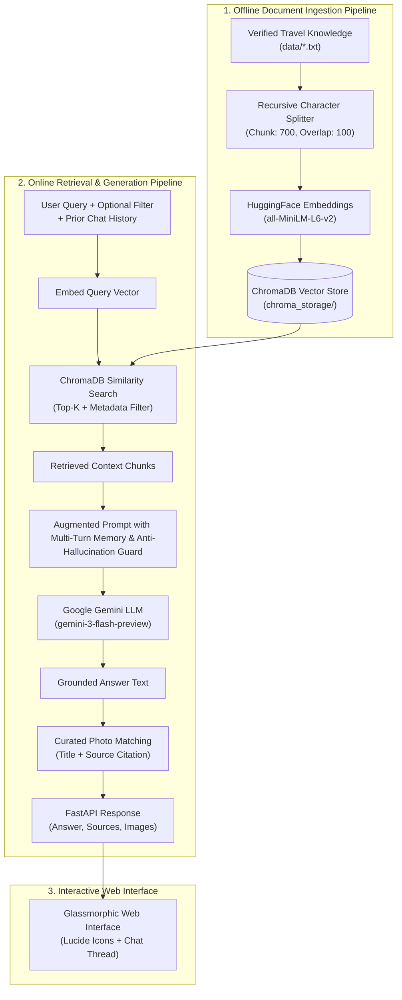

# 🌍 Travel RAG AI Assistant

A production-grade **Retrieval-Augmented Generation (RAG)** Travel Guide & Itinerary Planner built from scratch with **FastAPI**, **LangChain**, **ChromaDB**, **Sentence-Transformers (HuggingFace)**, and **Google Gemini LLM**.

The system specializes in **5 core Indian destinations** (**Goa**, **Mumbai**, **Bangalore**, **Gujarat**, and **Uttar Pradesh**), delivering grounded travel advice, multi-turn conversational memory, structured day-by-day itineraries, verified source badges, and curated landmark & culinary photos with full source citations.

---

## 🏗️ Architecture & Data Flow



---

## ✨ Key Features

- **Strict 5-Core Destination Specialization:** Expertly curated for **Goa**, **Mumbai**, **Bangalore**, **Gujarat**, and **Uttar Pradesh**. Non-core queries trigger an automated, polite refusal to prevent out-of-domain hallucinations.
- **Pure RAG Architecture:** 100% of facts are grounded in verified internal knowledge base files (`data/*.txt`) stored in ChromaDB.
- **Multi-Turn Conversational Memory:** Maintains session memory across consecutive turns, allowing users to ask natural follow-up questions.
- **Clear Chat Management:** One-click chat reset to wipe conversational memory and start a fresh session.
- **Curated Photo Cards with Citations:** Automatically attaches verified, high-definition travel photos for landmarks, temples, beaches, and local cuisine with official photo credits (zero AI token overhead).
- **Anti-Hallucination Guard:** If a detail is missing from the verified knowledge base, the model explicitly states it is unavailable rather than fabricating information.
- **Modern Glassmorphic UI:** Complete with vintage destination stamps, Lucide SVG icons, marked.js markdown rendering, and instant 3-Day itinerary generation.

---

## 🛠️ Tech Stack

### **Backend & AI Pipeline**
- **Python 3.10+**
- **FastAPI & Uvicorn:** High-performance RESTful backend server
- **LangChain:** Document chunking, prompt templating, and LCEL pipeline orchestration
- **ChromaDB:** Local persistent vector database with metadata filtering
- **Sentence-Transformers:** `all-MiniLM-L6-v2` dense embeddings (cached in memory)
- **Google Gemini LLM:** `gemini-3-flash-preview` / `gemini-2.5-flash` with resilient fallback logic

### **Frontend & Visuals**
- **HTML5 & Vanilla CSS3:** Custom responsive layout with glassmorphic cards and transparent overlay
- **JavaScript (ES6+):** Asynchronous fetch requests, session memory tracking, and routing
- **Lucide Icons:** Clean SVG icons for all UI controls and avatars
- **Marked.js:** Real-time client-side markdown rendering

---

## 📂 Project Structure

```text
travel-rag-core/
├── data/                       # Curated verified travel knowledge documents
│   ├── bangalore.txt
│   ├── goa.txt
│   ├── gujarat.txt
│   ├── mumbai.txt
│   └── uttar_pradesh.txt
├── static/                     # Web interface assets
│   ├── images/                 # Destination stamp images & backgrounds
│   │   ├── bangalore.jpeg
│   │   ├── bkgrnd.jpeg
│   │   ├── goa.jpeg
│   │   ├── gujarat.jpeg
│   │   ├── mumbai.jpeg
│   │   └── uttar_pradesh.jpeg
│   ├── index.html              # Interactive frontend UI
│   ├── style.css               # Glassmorphism & chat styling
│   └── app.js                  # Chat memory, API calls & Lucide icon handling
├── chroma_storage/             # Persistent ChromaDB vector database (auto-generated)
├── main.py                     # FastAPI application & CLI entry point
├── rag_engine.py               # Core RAG pipeline, embeddings, memory, and photo catalog
├── requirements.txt            # Python dependencies
├── .env                        # Environment variables (GOOGLE_API_KEY)
├── .gitignore                  # Git ignore rules
└── README.md                   # Project documentation
```

---

## 🚀 Quickstart Guide

### **1. Clone the Repository**
```bash
git clone <YOUR_REPOSITORY_URL>
cd travel-rag-core
```

### **2. Create & Activate Virtual Environment**
```bash
# Windows
python -m venv .venv
.venv\Scripts\activate

# macOS / Linux
python3 -m venv .venv
source .venv/bin/activate
```

### **3. Install Dependencies**
```bash
pip install -r requirements.txt
```

### **4. Configure API Key**
Create a `.env` file in the project root directory:
```env
GOOGLE_API_KEY=your_google_gemini_api_key_here
```

### **5. Run the Application**

#### **Start Web Server (FastAPI + Web UI):**
```bash
python main.py
```
*or using Uvicorn directly:*
```bash
uvicorn main:app --reload --port 8000
```
Open your browser and navigate to: **`http://127.0.0.1:8000`**

#### **Interactive CLI Mode:**
```bash
python main.py --cli
```

---

## 📡 REST API Reference

### **1. Query Travel Assistant**
`POST /query`

**Request Body:**
```json
{
  "query": "What are the best street food spots in Mumbai?",
  "destination": "Mumbai",
  "top_k": 4,
  "chat_history": [
    { "role": "user", "content": "Tell me about Mumbai" },
    { "role": "assistant", "content": "Mumbai is known for Marine Drive and Gateway of India." }
  ]
}
```

**Response:**
```json
{
  "query": "What are the best street food spots in Mumbai?",
  "destination_filter": "Mumbai",
  "answer": "Mumbai is famous for its vibrant street food culture...",
  "sources": [
    {
      "destination": "Mumbai",
      "source": "mumbai.txt",
      "snippet": "Street Food: Vada Pav, Pav Bhaji, Carter Road Khau Galli..."
    }
  ],
  "images": [
    {
      "title": "Mumbai Vada Pav",
      "url": "https://images.unsplash.com/photo-1601050690597-df0568f70950?w=800"
    }
  ]
}
```

---

### **2. Generate Day-by-Day Itinerary**
`POST /itinerary`

**Request Body:**
```json
{
  "destination": "Goa",
  "days": 3,
  "budget": "Mid-Range",
  "interests": ["Beaches", "Local Food", "Heritage"],
  "pace": "Moderate"
}
```

---

### **3. Re-Index Knowledge Base**
`POST /reindex` (or `POST /ingest`)

Re-chunks all files from `data/` and refreshes ChromaDB vectors.

**Response:**
```json
{
  "status": "success",
  "total_vectors": 97,
  "message": "Successfully re-indexed documents from data/ into ChromaDB!"
}
```

---

### **4. Health Check**
`GET /health`

**Response:**
```json
{
  "status": "healthy",
  "total_vectors_in_db": 97,
  "embedding_model": "sentence-transformers/all-MiniLM-L6-v2"
}
```

---

## 🛡️ Anti-Hallucination & Domain Integrity

1. **Grounded Context Only:** The prompt restricts Gemini from using speculative general training data for factual claims.
2. **Source Citations:** Every retrieved chunk is mapped to its source file in the knowledge base (`mumbai.txt`, `goa.txt`, etc.).
3. **Out-of-Domain Refusal:** Queries about destinations outside the 5 supported regions (*e.g., Kashmir, Himachal, international destinations*) are automatically deflected with a polite redirect to explore the 5 core states.

---

## 📄 License
This project is open source and available under the [MIT License](LICENSE).
